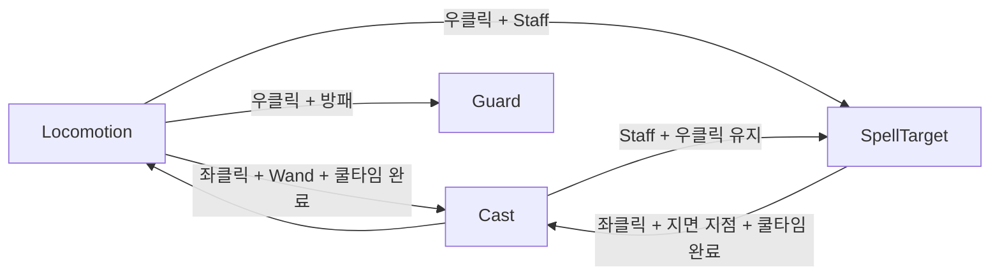

# Magic

## 개요
마법 무기(Wand/Staff)와 마법(Spell) 데이터, 시전, 쿨타임, 직선 마법탄과 지면 범위 마법. 마법 종류를 무기에서 분리해 SpellData 에셋 추가만으로 새 마법을 만든다. 플레이어·적 공용.

## 조작
| 무기 | 보조 장비 | 좌클릭 | 우클릭 (홀드) |
|---|---|---|---|
| **Wand** | 방패 또는 마법서 | 화면 중앙 방향 **직선 마법탄** (단일 대상) | 방패면 가드, 마법서면 없음 |
| **Staff** | **마법서만** (`allowsShield = false`) | 조준 모드에서만: 마법진 위치에 시전 | **조준 모드**: 마법진이 지면을 따라다님 + 숄더뷰 |

- **쿨타임**: 마법별 재사용 대기 (시전 시작 시 적용), 대기 중 좌클릭 무시.
- **Staff 범위 마법**: 시전 시작 시 조준 모드 해제 → 시전 모션 → 시전 위치에 마법진이 남고 `activationDelay` 후 범위 피해 → 시전 종료 시 우클릭 유지면 조준 모드 복귀.
- **데미지**: `무기 attackPower × 마법 damageMultiplier × 마법서 magicPowerMultiplier(장착 시)` 반올림.

## 구성 스크립트
| 파일 | 책임 |
|---|---|
| [SpellData.cs](../../Assets/Project/Scripts/Magic/Data/SpellData.cs) | 마법 공통(추상): 시전 모션·시점·길이, 쿨타임, 데미지 배율, `RequiresTargeting` |
| [ProjectileSpellData.cs](../../Assets/Project/Scripts/Magic/Data/ProjectileSpellData.cs) | 직선 마법탄 (중력 0, 명중 시 소멸) → `ToProfile()` |
| [AreaSpellData.cs](../../Assets/Project/Scripts/Magic/Data/AreaSpellData.cs) | 지면 범위 마법: 사거리, 조준 대기 모션·자세 고정, 마법진, 반경, 발동 지연, 범위 이펙트 |
| [MagicWeaponData.cs](../../Assets/Project/Scripts/Magic/Data/MagicWeaponData.cs) | 마법 무기 (WeaponData 상속): 마법, 마법탄 발사 지점 |
| [SpellCaster.cs](../../Assets/Project/Scripts/Magic/SpellCaster.cs) | 조준 마법진 표시, 시전 위치 마법진 + 지연 발동, `OverlapSphereNonAlloc` 범위 피해(대상당 1회) |
| [GroundTargeting.cs](../../Assets/Project/Scripts/Magic/GroundTargeting.cs) | 조준 레이의 지면 지점, 사거리 밖이면 사거리 끝 지면으로 제한 |
| [PlayerMagicCaster.cs](../../Assets/Project/Scripts/Player/PlayerMagicCaster.cs) | 장착 마법, 마법별 쿨타임, 데미지 계산(마법서 배율) |
| [States/](../../Assets/Project/Scripts/Player/States/) | `PlayerCastState`(시전), `PlayerSpellTargetState`(Staff 조준 모드) |

마법탄 비행·명중은 [Ranged Combat](RangedCombat.md)의 `RangedAttacker`/`Projectile`을 공유한다.

## 동작 흐름

```
PlayerCastState
 Enter: 대상 방향 회전, 쿨타임 시작, 시전 모션 (조준 뷰 해제)
 release 시점:
  ├─ ProjectileSpellData → 조준점 방향 직선 발사 (RangedAttacker.Fire)
  └─ AreaSpellData       → SpellCaster.CastArea(지정 위치) → 마법진 유지 → activationDelay 후 범위 피해 + 범위 이펙트
```

## 데이터 파라미터
### SpellData (공통)
| 필드 | 기본값 | 의미 |
|---|---|---|
| castStateName | Ranged_Magic_Shoot | 시전 모션 |
| releaseTime / castDuration | 0.3 / 0.8 | 발동 시점 / 시전 전체 길이 |
| cooldown | 1 | 재사용 대기 (초) |
| damageMultiplier | 1 | 무기 공격력 배율 |

### ProjectileSpellData
| 필드 | 기본값 | 의미 |
|---|---|---|
| projectilePrefab | — | `Projectile` 프리팹 (자식에 루프 파티클) |
| speed / lifetime | 30 / 3 | 비행 속도 / 최대 시간 |
| impactEffectPrefab | — | 명중 이펙트 (Looping 끈 Prefab Variant) |

### AreaSpellData
| 필드 | 기본값 | 의미 |
|---|---|---|
| maxRange | 15 | 마법진 최대 사거리 |
| targetingIdleStateName / targetingHoldTime | Ranged_Magic_Raise / 1 | 조준 대기 모션, 자세 고정 지점 |
| indicatorPrefab / indicatorScale | — / 1 | 마법진 (Looping 켠 상태), 크기 배율 |
| radius | 3 | 범위 피해 반경 |
| activationDelay | 0.6 | 시전 후 발동까지 지연 |
| areaEffectPrefab | — | 발동 이펙트 (Looping 끈 Prefab Variant) |

### MagicWeaponData / 컴포넌트
| 대상 | 필드 | 기본값 | 의미 |
|---|---|---|---|
| MagicWeaponData | spell | — | 기본 마법 |
| MagicWeaponData | muzzleOffset | (0.3, 1.4, 0.6) | 마법탄 발사 지점 (캐릭터 로컬) |
| SpellCaster | areaDamageLayers | Default | 범위 피해 대상 (**Player 제외**) |
| SpellCaster | groundLayers | Default | 마법진 지면 (**캐릭터·투사체 제외**) |
| SpellCaster | maxTargetingRayDistance / groundProbeHeight | 100 / 10 | 지면 탐색 레이 |
| SpellbookData | magicPowerMultiplier | 1.2 | 마법 데미지 배율 |

## 에디터 설정
1. **이펙트**: Hovl `Magic effects pack` 머티리얼을 Render Pipeline Converter(Built-in → URP, Material Upgrade)로 변환, Bloom 권장.
2. **Prefab Variant**: 원본 Hovl 프리팹은 수정하지 않고 `Assets/Project/Prefabs/Effects/`에 Variant 생성.
   - 1회 재생(명중·범위 발동): **루트 포함 모든 파티클 Looping 끄기** (하나라도 켜져 있으면 5초 후 강제 반환 + 경고)
   - 지속(마법진·마법탄 비주얼): Looping 유지
3. **마법탄 프리팹**: 빈 루트(`Projectile`, Layer Projectile) + 자식 이펙트(`Sparks blue` Variant 등).
4. **데이터**: `Create → ProjectFantasy → Magic → Projectile Spell / Area Spell` → Wand·Staff의 `Spell`에 지정.
5. **애니메이터**: `Ranged_Magic_Shoot`, `Ranged_Magic_Spellcasting`, `Ranged_Magic_Raise`. Raise는 들어올림→내림이 한 클립이라 `PoseSpeed` Multiplier + `targetingHoldTime`으로 자세 고정.
6. **플레이어**: `PlayerMagicCaster`, `SpellCaster` 추가, 레이어 마스크 설정.

## 주의사항 / 확장 포인트
- 새 마법은 `SpellData` 파생 에셋 추가 (예: 다른 이펙트·데미지의 직선/범위 마법). 새 형태(관통, 유도 등)는 `SpellData` 파생 클래스 + `PlayerCastState.Release` 분기 추가.
- 적이 Default 레이어면 마법진이 적 위에 올라갈 수 있음 → 적 기능에서 Enemy 레이어 분리.
- 예정: 마나 자원, 마법 습득·교체, 속성 효과(화상·빙결), 시전 사운드.

## 변경 이력
| 날짜 | 내용 |
|---|---|
| 2026-10-02 | 최초 작성 (Wand 직선 마법탄, Staff 지면 범위 마법·마법진 조준, 쿨타임, 마법서 배율, 시전 중 조준 해제) |
