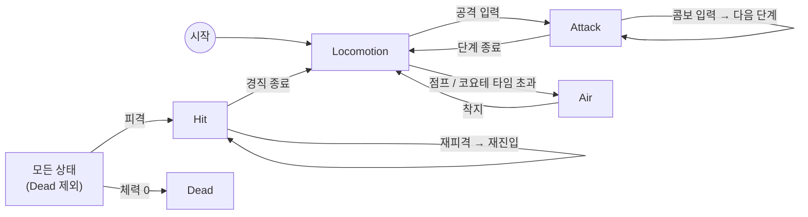

# Player

## 개요
카메라 기준 이동, 걷기/달리기, 점프, 콤보 공격, 피격/사망을 처리하는 플레이어 캐릭터. 기준 캐릭터는 KayKit **Rogue**.

## 구성 스크립트
| 파일 | 책임 |
|---|---|
| [PlayerController.cs](../../Assets/Project/Scripts/Player/PlayerController.cs) | 컴포넌트 조립, 상태 머신 구동, 카메라 기준 이동 벡터 계산, 체력 이벤트 → 상태 전이 |
| [PlayerInputHandler.cs](../../Assets/Project/Scripts/Player/PlayerInputHandler.cs) | 입력 수집, 공격/점프 선입력 버퍼 |
| [PlayerMotor.cs](../../Assets/Project/Scripts/Player/PlayerMotor.cs) | CharacterController 이동, 가속/감속, 중력, 접지, 회전 |
| [PlayerAnimator.cs](../../Assets/Project/Scripts/Player/PlayerAnimator.cs) | 애니메이터 상태 재생(해시 캐싱, 중복 CrossFade 방지), 상태 누락 검증 |
| [PlayerMovementData.cs](../../Assets/Project/Scripts/Player/Data/PlayerMovementData.cs) | 이동/점프 튜닝 데이터 (SO) |
| [States/](../../Assets/Project/Scripts/Player/States/) | `PlayerStateBase`, `Locomotion`, `Air`, `Attack`, `Hit`, `Dead` |

## 동작 흐름
### 프레임 처리 순서
```
PlayerController.Update
 ├─ StateMachine.Tick   // 상태가 입력을 해석해 모터에 목표 속도/회전 지시
 └─ PlayerMotor.Tick    // 가속·중력 적용 후 CharacterController.Move 1회
ThirdPersonCamera.LateUpdate  // 이동이 끝난 뒤 카메라 갱신
```

### 상태 전이


| 상태 | 역할 |
|---|---|
| Locomotion | 지상 이동. 애니메이션은 수평 속도로 Idle/Walk/Run 자동 분기 |
| Air | 점프·낙하. 공중 가속(airAcceleration)으로 제어, 코요테 타임 내 점프 허용 |
| Attack | 입력 방향으로 즉시 회전 → 전진 스텝 → 히트 윈도우 동안 타격 판정 → 콤보 연계 |
| Hit | 입력 버퍼 초기화, 가해 방향을 바라보며 넉백 후 경직 |
| Dead | 종료 상태. 입력 무시, 사망 애니메이션 |

### 이동 속도
- 기본은 **걷기(WalkSpeed)**, 달리기 버튼(Sprint)을 누르고 있으면 **달리기(RunSpeed)**.
- 최종 속도 = 기본 속도 × 입력 크기 → 패드 스틱은 기울기에 비례, 키보드는 항상 최대.
- 이동 방향은 카메라 forward/right를 수평 투영해 계산 (`PlayerController.GetCameraRelativeMove`).

### 선입력 / 코요테 타임
- 공격·점프 입력은 `inputBufferTime`(0.2초) 동안 보관 후 `Consume*()` 시 소모.
- 지면을 벗어난 뒤 `coyoteTime`(0.15초)까지는 지상 판정 유지 → 경사·계단에서 Air 전환 떨림 방지 + 늦은 점프 허용.

## 데이터 파라미터
### PlayerMovementData
| 필드 | 기본값 | 의미 |
|---|---|---|
| walkSpeed | 2 | 기본 이동 속도 (m/s) |
| runSpeed | 5 | 달리기 버튼 입력 시 속도 |
| acceleration / deceleration | 30 / 40 | 지상 가속·감속 (m/s²) |
| airAcceleration | 8 | 공중 가감속 |
| rotationSpeed | 720 | 회전 속도 (°/s) |
| jumpHeight | 1.2 | 점프 높이 (m), 초기 속도 = √(2gh) |
| gravity | 25 | 중력 가속도 |
| groundedStickForce | 2 | 접지 유지용 하강 속도 |
| maxFallSpeed | 50 | 최대 낙하 속도 |
| coyoteTime | 0.15 | 코요테 타임 (초) |

### 컴포넌트 인스펙터 값
| 컴포넌트 | 필드 | 기본값 | 의미 |
|---|---|---|---|
| PlayerInputHandler | inputBufferTime | 0.2 | 선입력 유지 시간 |
| PlayerAnimator | idleSpeedThreshold | 0.1 | 이 속도 미만이면 Idle |
| PlayerAnimator | runSpeedThreshold | 3.5 | 이 속도 이상이면 Run |
| PlayerAnimator | locomotionCrossFade / actionCrossFade | 0.15 / 0.1 | 전환 시간 |

## 에디터 설정
1. **애니메이터(`Player.controller`)** – 아래 상태가 있어야 한다. 전이 화살표는 불필요(코드에서 CrossFade).

   | 용도 | 상태 이름 | 클립 출처 |
   |---|---|---|
   | Idle / Walk / Run | `Idle_A` / `Walking_B` / `Running_B` | Rig_Medium_General, MovementBasic |
   | 공중 | `Jump_Idle` | Rig_Medium_MovementBasic |
   | 피격 / 사망 | `Hit_A` / `Death_A` | Rig_Medium_General |
   | 공격 1~3 | `Melee_1H_Attack_Slice_Horizontal` / `_Slice_Diagonal` / `_Chop` | Rig_Medium_CombatMelee |

2. **Rogue 프리팹** – `PlayerController` 추가 시 Input/Motor/Animator/MeleeAttacker/Health/CharacterController 자동 추가.
   - CharacterController Height/Center를 캐릭터 크기에 맞춤
   - InputHandler에 `InputSystem_Actions`의 Player/Move, Attack, Jump, Sprint 연결
   - Movement/AttackCombo/HitReaction 데이터 연결, Layer를 **Player**로 지정

## 주의사항 / 확장 포인트
- 애니메이터 상태 이름은 **정확히 일치**해야 한다. 누락 시 시작할 때 콘솔에 `[PlayerAnimator] 애니메이터에 'XXX' 상태가 없습니다.` 에러 (에디터/개발 빌드 전용 `[Conditional]` 검증).
- `walkSpeed`를 `runSpeedThreshold`(3.5) 이상으로 올리면 걷기에도 Run 애니메이션이 나온다. 두 값을 함께 조정.
- 루트 모션은 사용하지 않음 (`applyRootMotion = false`), 이동은 전부 PlayerMotor가 담당.
- 예정: 주목(락온), 회피/저스트 회피, 스태미나, 점프 시작/착지 애니메이션.

## 변경 이력
| 날짜 | 내용 |
|---|---|
| 2026-09-30 | 최초 작성 (이동, 점프, 3단 콤보, 피격, 사망) |
| 2026-09-30 | 기본 걷기 / 달리기 버튼 시 달리기로 변경 (`sprintSpeed`, `walkInputThreshold` 제거), 애니메이터 상태 누락 검증 추가 |
