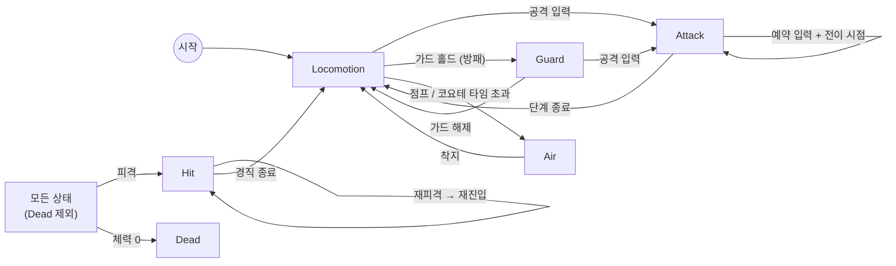

# Player

## 개요
카메라 기준 이동, 걷기/달리기, 점프, 콤보 공격, 방패 가드, 원거리 조준·발사, 마법 시전, 줍기·아이템 사용, 퀵슬롯 장착, 피격/사망을 처리하는 플레이어 캐릭터. 기준 캐릭터는 KayKit **Rogue**.

## 구성 스크립트
| 파일 | 책임 |
|---|---|
| [PlayerController.cs](../../Assets/Project/Scripts/Player/PlayerController.cs) | 컴포넌트 조립, 상태 머신 구동, 카메라 기준 이동 벡터 계산, 체력/무기 이벤트 → 상태 전이 |
| [PlayerInputHandler.cs](../../Assets/Project/Scripts/Player/PlayerInputHandler.cs) | 입력 액션 에셋에서 이름으로 액션 탐색, 공격/점프/줍기/퀵슬롯 선입력 버퍼, 메뉴 중 게임플레이 입력 차단 |
| [PlayerMotor.cs](../../Assets/Project/Scripts/Player/PlayerMotor.cs) | CharacterController 이동, 가속/감속, 중력, 접지, 회전 |
| [PlayerAnimator.cs](../../Assets/Project/Scripts/Player/PlayerAnimator.cs) | 애니메이터 상태 재생(해시 캐싱, 중복 CrossFade 방지), 무기별 대기 모션, 상태 누락 검증 (상태 이름은 `PlayerAnimationData`) |
| [PlayerLoadout.cs](../../Assets/Project/Scripts/Player/PlayerLoadout.cs) | 장착 무기·보조 장비 **개체** 적용, 무기와 맞지 않는 보조 장비 비활성 ([Weapon](Weapon.md), [Inventory](Inventory.md)) |
| [PlayerRangedWeapon.cs](../../Assets/Project/Scripts/Player/PlayerRangedWeapon.cs) / [PlayerAmmoVisual.cs](../../Assets/Project/Scripts/Player/PlayerAmmoVisual.cs) | 원거리 발사·장전 규칙, 화살 표시 ([Ranged Combat](RangedCombat.md)) |
| [PlayerMagicCaster.cs](../../Assets/Project/Scripts/Player/PlayerMagicCaster.cs) | 마법 쿨타임·데미지 ([Magic](Magic.md)) |
| [PlayerAimPresenter.cs](../../Assets/Project/Scripts/Player/PlayerAimPresenter.cs) | 조준 뷰 → 카메라 숄더뷰·조준점 |
| [PlayerItemHandler.cs](../../Assets/Project/Scripts/Player/PlayerItemHandler.cs) / [PlayerInteractor.cs](../../Assets/Project/Scripts/Player/PlayerInteractor.cs) | 아이템 장착·사용·버리기·줍기, 주변 아이템 탐색 ([Inventory](Inventory.md)) |
| [PlayerMenuPresenter.cs](../../Assets/Project/Scripts/Player/PlayerMenuPresenter.cs) / [PlayerHudPresenter.cs](../../Assets/Project/Scripts/Player/PlayerHudPresenter.cs) | 인벤토리·숙련도 창 ↔ 입력·카메라 (하나라도 열리면 차단), HUD·숙련 안내 연결 |
| [PlayerMasteryRewarder.cs](../../Assets/Project/Scripts/Player/PlayerMasteryRewarder.cs) / [WeaponMastery.cs](../../Assets/Project/Scripts/Mastery/WeaponMastery.cs) | 처치 보상 → 장착 무기·보조 장비 숙련 경험치, 숙련 레벨·티어 장착 조건·보너스 ([Mastery](Mastery.md)) |
| [PlayerMovementData.cs](../../Assets/Project/Scripts/Player/Data/PlayerMovementData.cs) | 이동/점프 튜닝 데이터 (SO) |
| [PlayerAnimationData.cs](../../Assets/Project/Scripts/Player/Data/PlayerAnimationData.cs) | 애니메이터 상태 이름·파라미터·전환 시간·이동 모션 분기 속도 (SO) |
| [States/](../../Assets/Project/Scripts/Player/States/) | `PlayerStateBase`, `Locomotion`, `Air`, `Attack`, `Guard`, `Aim`, `RangedFire`, `Reload`, `Cast`, `SpellTarget`, `PickUp`, `UseItem`, `Hit`, `Dead` |

## 동작 흐름
### 프레임 처리 순서
```
PlayerController.Update
 ├─ StateMachine.Tick   // 상태가 입력을 해석해 모터에 목표 속도/회전 지시
 └─ PlayerMotor.Tick    // 가속·중력 적용 후 CharacterController.Move 1회
ThirdPersonCamera.LateUpdate  // 이동이 끝난 뒤 카메라 갱신
```

### 상태 전이


| 상태 | 역할 |
|---|---|
| Locomotion | 지상 이동, 줍기(E), 퀵슬롯(1~8) 장착·사용. 애니메이션은 수평 속도로 Idle/Walk/Run 자동 분기 |
| PickUp / UseItem | 줍기 모션 후 가방에 추가 / 소모품 사용(느린 이동, 효과 시점에 소모) ([Inventory](Inventory.md)) |
| Air | 점프·낙하. 공중 가속(airAcceleration)으로 제어, 코요테 타임 내 점프 허용 |
| Attack | 입력 방향으로 즉시 회전 → `ActionPlayer`로 액션 타임라인 재생(`IActionContext` 구현: 타격 구간·콤보 창·전진) → 예약 입력 시 전이 프레임에 다음 액션 ([Combat](Combat.md)) |
| Guard | 방패 가드 홀드. 느린 이동(guardMoveSpeed), 막으면 Block_Hit + 넉백 경직, 가드 중 공격 가능 |
| Aim / RangedFire / Reload | 활·석궁 조준·발사·장전 ([Ranged Combat](RangedCombat.md)) |
| Cast / SpellTarget | 마법 시전 / Staff 마법진 조준 ([Magic](Magic.md)) |

**좌클릭·우클릭 분기** (`PlayerStateBase.TryStartPrimaryAction / TryStartSecondaryAction`)
| 장착 무기 | 좌클릭 | 우클릭 홀드 |
|---|---|---|
| 근접 / 맨손 | 콤보 공격 | 방패 가드 |
| 활 / 양손 석궁 | 발사 | 조준 모드 |
| 한손 석궁 | 발사 | 방패 가드 |
| Wand | 마법탄 | 방패 가드 |
| Staff | (조준 모드에서) 시전 | 마법진 조준 모드 |

- 상태마다 `UsesAimView`를 선언하고, 상태 전이 시 `PlayerController.AimViewChanged`로 숄더뷰·조준점을 전환한다.
| Hit | 입력 버퍼 초기화, 가해 방향을 바라보며 넉백 후 경직 |
| Dead | 종료 상태. 입력 무시, 사망 애니메이션 |

### 이동 속도
- 기본은 **걷기(WalkSpeed)**, 달리기 버튼(Sprint)을 누르고 있으면 **달리기(RunSpeed)**, 가드 중은 **GuardMoveSpeed**.
- 최종 속도 = 기본 속도 × 입력 크기 → 패드 스틱은 기울기에 비례, 키보드는 항상 최대.
- 이동 방향은 카메라 forward/right를 수평 투영해 계산 (`PlayerController.GetCameraRelativeMove`).

### 입력
| 액션 | 키보드/마우스 | 게임패드 | 처리 |
|---|---|---|---|
| Move | WASD | 왼쪽 스틱 | 매 프레임 읽기 |
| Attack | 마우스 왼쪽 | West 버튼 | 선입력 버퍼 |
| Jump | Space | South 버튼 | 선입력 버퍼 |
| Sprint | Left Shift | 왼쪽 스틱 누름 | 홀드 |
| Secondary (구 Guard) | 마우스 오른쪽 | 왼쪽 트리거 | 홀드 (무기에 따라 가드/조준) |
| Interact | E | North | 선입력 버퍼 (줍기) |
| Inventory | Tab | Start | 인벤토리 창 토글 (메뉴 중에도 동작) |
| Mastery | K | — | 숙련도 창 토글 (메뉴 중에도 동작) |
| QuickSlot | 1~8 | — | 선입력 버퍼 (바인딩 순서 = 슬롯 번호) |
| Zoom | 마우스 휠 | — | 카메라 줌 ([Camera](Camera.md)) |

### 선입력 / 코요테 타임
- 공격·점프·줍기·퀵슬롯 입력은 `inputBufferTime`(0.2초) 동안 보관 후 `Consume*()` 시 소모.
- 지면을 벗어난 뒤 `coyoteTime`(0.15초)까지는 지상 판정 유지 → 경사·계단에서 Air 전환 떨림 방지 + 늦은 점프 허용.

## 데이터 파라미터
### PlayerMovementData
| 필드 | 기본값 | 의미 |
|---|---|---|
| walkSpeed | 2 | 기본 이동 속도 (m/s) |
| runSpeed | 5 | 달리기 버튼 입력 시 속도 |
| guardMoveSpeed | 1.2 | 가드 중 이동 속도 |
| aimMoveSpeed | 1.5 | 조준 모드 이동 속도 |
| acceleration / deceleration | 30 / 40 | 지상 가속·감속 (m/s²) |
| airAcceleration | 8 | 공중 가감속 |
| rotationSpeed | 720 | 회전 속도 (°/s) |
| jumpHeight | 1.2 | 점프 높이 (m), 초기 속도 = √(2gh) |
| gravity | 25 | 중력 가속도 |
| groundedStickForce | 2 | 접지 유지용 하강 속도 |
| maxFallSpeed | 50 | 최대 낙하 속도 |
| coyoteTime | 0.15 | 코요테 타임 (초) |

### 컴포넌트 인스펙터 값
| 컴포넌트 | 필드 | 기본값 | 의미 |
|---|---|---|---|
| PlayerInputHandler | inputBufferTime | 0.2 | 선입력 유지 시간 |
| PlayerAnimationData | idle / runSpeedThreshold | 0.1 / 3.5 | 대기 → 걷기 → 달리기 분기 속도 |
| PlayerAnimationData | locomotion / actionCrossFade | 0.15 / 0.1 | 전환 시간 |
| PlayerAnimationData | pose / actionSpeedParameter | PoseSpeed / ActionSpeed | 조준 자세 고정 / 공격 재생 속도 Float 파라미터 |
| PlayerController | minAimFacingDistance | 1.5 | 조준 지점이 가까우면 카메라 정면을 바라봄 |

### 조준 자세 고정
- 조준 대기 클립의 **마지막 프레임이 조준 자세**면 Loop만 끄면 된다 (활, 양손 석궁).
- 들어올림→내림이 한 클립인 경우(`Ranged_Magic_Raise`): 상태 Speed Multiplier를 `PoseSpeed`로 연결하고 데이터의 hold time(정규화 시간)을 지정 → 도달 시 `PoseSpeed = 0`, 다른 모션 전환 시 1로 복구.

## 에디터 설정
1. **애니메이터(`Player.controller`)** – 아래 상태가 있어야 한다. 전이 화살표는 불필요(코드에서 CrossFade). 무기별 콤보·대기 상태는 [Weapon](Weapon.md) 참고.

   | 용도 | 상태 이름 | 클립 출처 |
   |---|---|---|
   | Idle / Walk / Run | `Idle_A` / `Walking_B` / `Running_B` | Rig_Medium_General, MovementBasic |
   | 공중 | `Jump_Idle` | Rig_Medium_MovementBasic |
   | 피격 / 사망 | `Hit_A` / `Death_A` | Rig_Medium_General |
   | 가드 / 막기 | `Melee_Blocking` / `Melee_Block_Hit` | Rig_Medium_CombatMelee |
   | 조준 이동 | `Walking_Backwards` / `Running_Strafe_Left` / `Running_Strafe_Right` (Loop) | Rig_Medium_MovementAdvanced |

   Float 파라미터 `PoseSpeed`(기본 1) 추가, 자세 고정이 필요한 조준 대기 상태의 Speed Multiplier에 연결.
   Float 파라미터 `ActionSpeed`(기본 1) 추가, 모든 공격 상태의 Speed Multiplier에 연결.

2. **Rogue 프리팹** – `PlayerController` 추가 시 필요한 컴포넌트 자동 추가 (Input, Motor, Animator, MeleeAttacker, Health, PlayerLoadout, ShieldGuard, PlayerRangedWeapon, RangedAttacker, PlayerAmmoVisual, PlayerMagicCaster, SpellCaster, HitStop, CharacterController). 이미 있는 오브젝트는 RequireComponent가 자동 추가되지 않으므로 수동 추가.
   - CharacterController Height/Center를 캐릭터 크기에 맞춤
   - InputHandler **Action Asset**에 `InputSystem_Actions` 1개 연결 (Player 맵의 액션을 이름으로 탐색, 이름이 다르면 시작 시 에러), PlayerAnimator **Data**에 `PlayerAnimationData` 연결
   - Movement / HitReaction 데이터 연결 (콤보는 무기 데이터에서 가져옴), Layer를 **Player**로 지정

## 주의사항 / 확장 포인트
- 애니메이터 상태 이름은 **정확히 일치**해야 한다. 누락 시 시작할 때 콘솔에 `[PlayerAnimator] 애니메이터에 'XXX' 상태가 없습니다.` 에러 (에디터/개발 빌드 전용 `[Conditional]` 검증, 보유 무기의 콤보·대기 상태 포함).
- `walkSpeed`를 `runSpeedThreshold`(3.5) 이상으로 올리면 걷기에도 Run 애니메이션이 나온다. 두 값을 함께 조정.
- 루트 모션은 사용하지 않음 (`applyRootMotion = false`), 이동은 전부 PlayerMotor가 담당.
- 가드 중 이동은 전신 가드 모션이라 발이 미끄러져 보임 → 상체 레이어(Avatar Mask) 도입 시 개선.
- 예정: 주목(락온), 회피/저스트 회피, 스태미나, 점프 시작/착지 애니메이션.

## 변경 이력
| 날짜 | 내용 |
|---|---|
| 2026-09-30 | 최초 작성 (이동, 점프, 3단 콤보, 피격, 사망) |
| 2026-09-30 | 기본 걷기 / 달리기 버튼 시 달리기로 변경 (`sprintSpeed`, `walkInputThreshold` 제거), 애니메이터 상태 누락 검증 추가 |
| 2026-10-01 | Guard 상태, 무기 교체 입력, `PlayerLoadout` 연동, 무기별 대기 모션, 콤보 입력 예약 방식 |
| 2026-10-02 | 원거리(Aim/RangedFire/Reload)·마법(Cast/SpellTarget) 상태, 좌/우클릭 무기별 분기, 조준 뷰 이벤트, 스트레이프 이동, 조준 자세 고정, Guard 입력 → Secondary |
| 2026-10-02 | Attack 상태를 액션 타임라인(`ActionPlayer`) 기반으로 전환, `HitStop` 중 상태·이동 정지, `ActionSpeed` 파라미터 |
| 2026-10-06 | 줍기·소모품 사용 상태, 퀵슬롯·줍기·인벤토리·줌 입력, 무기 순환 입력 삭제, 입력 액션 에셋 일괄 탐색, `PlayerAnimationData` 분리, 아이템·HUD Presenter |
| 2026-10-07 | 무기 숙련도(`WeaponMastery`·`PlayerMasteryRewarder`), 숙련도 창 입력(K), 숙련 보너스가 공격력·마법력·방패 방어력에 반영, 숙련 부족 장비 장착 거부 |
