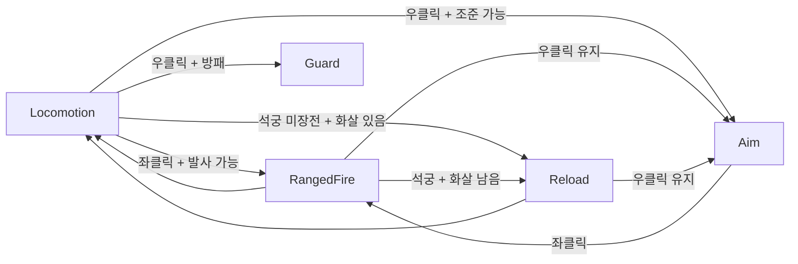

# Ranged Combat

## 개요
활·석궁의 조준, 발사, 화살 소모, 석궁 장전과 범용 투사체(포물선 비행, 명중 시 피해 + 박힘/소멸, 풀링), 조준 모드 숄더뷰·경로 미리보기. 투사체는 마법탄([Magic](Magic.md))과 공용.

## 조작
| 무기 | 좌클릭 | 우클릭 (홀드) |
|---|---|---|
| 활 (양손) | 발사 (비조준 시 당기기 → 쏘기) | 조준 모드 |
| 양손 석궁 | 발사 | 조준 모드 |
| 한손 석궁 | 발사 | 방패가 있으면 가드 (조준 모드 없음) |

- **발사 조건**: 활은 화살 1개 이상, 석궁은 장전 완료.
- **석궁 장전**: 발사 후 화살이 남아 있으면 자동 Reload, 미장전 석궁을 들고 있으면 대기 중 자동 Reload.
- **조준 모드**: 숄더뷰 + 조준점 + 경로 미리보기, 캐릭터는 조준 지점을 바라보며 느리게 스트레이프 이동.
- **비조준 발사**: 조준점은 숨겨지지만 화면 중앙 방향으로 발사.

## 구성 스크립트
| 파일 | 책임 |
|---|---|
| [RangedWeaponData.cs](../../Assets/Project/Scripts/Weapon/Data/RangedWeaponData.cs) | 화살 종류, 조준·장전 여부, 발사 지점·속도, windup/fire/aim/reload 모션·타이밍, 조준 자세 고정, 장전 볼트 위치 |
| [AmmoData.cs](../../Assets/Project/Scripts/Weapon/Data/AmmoData.cs) | 화살 모델(시위 표시), 투사체 프리팹, 중력, 수명, 박힘 시간, 명중 이펙트 → `ToProfile()` |
| [Inventory.cs](../../Assets/Project/Scripts/InventorySystem/Inventory.cs) | 화살 보유 수 = 가방의 화살 수량 (`GetCount` / `TryConsume`, [Inventory](Inventory.md)) |
| [PlayerRangedWeapon.cs](../../Assets/Project/Scripts/Player/PlayerRangedWeapon.cs) | 발사/조준/장전 가능 여부, 화살 소모, 석궁별 장전 상태, 투사체 설정 조합 |
| [PlayerAmmoVisual.cs](../../Assets/Project/Scripts/Player/PlayerAmmoVisual.cs) | 활 시위 화살(오른손), 석궁 장전 볼트 표시 |
| [PlayerAimPresenter.cs](../../Assets/Project/Scripts/Player/PlayerAimPresenter.cs) | 조준 상태 → 카메라 숄더뷰·조준점 표시 연결 |
| [States/](../../Assets/Project/Scripts/Player/States/) | `PlayerAimState`, `PlayerRangedFireState`, `PlayerReloadState` |
| [RangedAttacker.cs](../../Assets/Project/Scripts/Combat/RangedAttacker.cs) | 조준 지점 계산, 발사 속도, 경로 예측, 투사체 발사, 투사체·명중 이펙트 풀 |
| [Ballistics.cs](../../Assets/Project/Scripts/Combat/Projectile/Ballistics.cs) | 포물선 위치/속도 공식, 경로 샘플링 (미리보기·비행 공용) |
| [Projectile.cs](../../Assets/Project/Scripts/Combat/Projectile/Projectile.cs) | 범용 투사체: 비행, 구간 레이캐스트, 명중 시 피해·이펙트 후 박힘 또는 소멸, 대상 소멸 시 풀 반환 |
| [ProjectileProfile.cs](../../Assets/Project/Scripts/Combat/Projectile/ProjectileProfile.cs) | 투사체 설정 값 타입 (속도, 중력, 수명, 박힘 여부, 명중 이펙트) |
| [TrajectoryPreview.cs](../../Assets/Project/Scripts/Combat/Projectile/TrajectoryPreview.cs) | LineRenderer 경로 표시 (버퍼 재사용) |

## 동작 흐름
### 상태 전이

- 조준 뷰는 상태의 `UsesAimView`로 결정 → `PlayerController.AimViewChanged` → `PlayerAimPresenter`가 카메라·조준점 전환.

### 발사 (`PlayerRangedFireState`)
```
Enter: 조준 지점 방향으로 즉시 회전, 활이면 시위 화살 표시
 ├─ 비조준 + windup 있음(활) → windup(당기기) → fire
 └─ 조준 중 / 석궁           → fire
release 시점: 발사 속도 계산 → 화살 소모(활) 또는 장전 볼트 사용(석궁) → RangedAttacker.Fire
종료: 석궁 재장전 필요 → Reload / 우클릭 유지 → Aim / 그 외 Locomotion
```

### 조준과 탄도
- **조준 지점**: 카메라 중앙 레이가 처음 닿는 지점 (없으면 `maxAimDistance`), 프레임당 1회 캐싱.
- **캐릭터 방향**: 캐릭터 → 조준 지점 수평 방향 (몸·활·조준선 일치). 1.5m 이내 또는 뒤쪽이면 카메라 정면.
- **발사 방향**: 발사 지점 → 조준 지점으로 **직사** (각도 보정 없음). 가까우면 조준점에 명중, 멀수록 중력으로 조준점 아래로 떨어짐(야숨 방식).
- **비행**: `위치 = 원점 + v·t + ½·g·t²` 해석적 계산(프레임레이트 무관), 이전→현재 위치 구간 레이캐스트로 명중 판정.
- **경로 미리보기**: 같은 공식으로 0.03초 간격 샘플링, 충돌 지점에서 종료 → 미리보기와 실제 경로 일치.

### 명중 / 박힘 / 풀링
- `IDamageable`이면 피해(화살 = 장착 개체 공격력, 물리 / 마법탄 = 마법 피해), 명중 이펙트(1회 재생) 후 화살은 박힘 / 마법탄은 소멸.
- 박힐 때 부모로 붙이지 않고 **맞은 Transform 기준 로컬 자세를 기억해 `LateUpdate`에서 추적** → 움직이는 대상도 따라감.
- 대상이 **파괴/비활성화되면 즉시 풀 반환**, 그 외 `stickDuration` 후, 비행 중 `lifetime` 초과 시 반환.
- 투사체는 `PrefabPool<Projectile>`, 이펙트는 `EffectPool`로 풀링 ([Combat](Combat.md)).

## 데이터 파라미터
### RangedWeaponData (WeaponData 상속)
| 필드 | 기본값 | 의미 |
|---|---|---|
| ammo | — | 사용할 화살 (AmmoData) |
| canAim | true | 우클릭 조준 모드 사용 (한손 석궁 false) |
| requiresReload | false | 발사 후 장전 필요 (석궁 true) |
| muzzleOffset | (0, 1.4, 0.5) | 캐릭터 로컬 발사 지점 (조준 모드 경로선 시작점으로 확인) |
| launchSpeed | 40 | 발사 속도 (활 40, 석궁 50) |
| windupStateName / windupDuration | Ranged_Bow_Draw / 0.5 | 비조준 발사 시 선행 모션 (비우면 생략) |
| fireStateName / releaseTime / fireDuration | Ranged_Bow_Release / 0.05 / 0.5 | 발사 모션, 화살이 나가는 시점, 전체 길이 |
| aimIdleStateName / aimHoldTime | Ranged_Bow_Aiming_Idle / 1 | 조준 대기 모션, 자세 고정 지점(1 = 고정 안 함) |
| reloadStateName / reloadDuration | — / 1 | 장전 모션·길이 |
| loadedAmmoPosition / Rotation | 0 / 0 | 장전 볼트의 무기 모델 기준 자세 |

### AmmoData (EquipmentData 상속)
| 필드 | 기본값 | 의미 |
|---|---|---|
| modelPrefab / grip | — | 활 시위에 건 화살 표시용 모델 |
| projectilePrefab | — | `Projectile` 프리팹 |
| gravity | 9.81 | 낙하 정도 (낮을수록 직선, 야숨 느낌 4~6) |
| lifetime | 5 | 비행 최대 시간 |
| stickDuration | 10 | 박힌 뒤 사라질 때까지 |
| impactEffectPrefab | — | 명중 이펙트 (Looping 끈 Prefab Variant) |

### 컴포넌트 인스펙터 값
| 컴포넌트 | 필드 | 기본값 | 의미 |
|---|---|---|---|
| RangedAttacker | maxAimDistance | 100 | 조준 레이 최대 거리 |
| RangedAttacker | aimLayers / projectileHitLayers | Default | **Player, Projectile 제외** 필수 |
| RangedAttacker | previewTimeStep | 0.03 | 경로 미리보기 샘플 간격 |
| TrajectoryPreview | maxPoints | 64 | 미리보기 최대 점 수 |
| PlayerController | minAimFacingDistance | 1.5 | 이보다 가까운 조준 지점은 카메라 정면을 바라봄 |
| PlayerMovementData | aimMoveSpeed | 1.5 | 조준 중 이동 속도 |

## 에디터 설정
1. **애니메이터 상태**: `Ranged_Bow_Draw`, `Ranged_Bow_Aiming_Idle`, `Ranged_Bow_Release`, `Ranged_1H_Shoot`, `Ranged_1H_Reload`, `Ranged_2H_Aiming`, `Ranged_2H_Shoot`, `Ranged_2H_Reload`, `Walking_Backwards`·`Running_Strafe_Left`·`Running_Strafe_Right`(Loop)
2. **조준 대기 클립**: `Ranged_Bow_Aiming_Idle`, `Ranged_2H_Aiming`은 **Loop 끔** → 마지막 프레임(조준 자세) 유지. 들어올림→내림이 한 클립인 경우만 `PoseSpeed` + hold time 사용 ([Player](Player.md)).
3. **클립 Root Transform**: 추출한 .anim 전부 Rotation / Y / XZ **Bake Into Pose ✓ + Based Upon: Original**. 활 모션은 몸을 약 25° 튼 사수 자세라 Body Orientation이면 활 방향이 틀어짐.
4. **화살 프리팹**: 빈 루트(`Projectile`, Layer **Projectile**) + 자식 모델(`arrow_bow`/`arrow_crossbow`)을 화살촉이 **+Z**를 향하게 배치. 콜라이더 불필요.
5. **데이터**: AmmoData(화살, 볼트, Max Stack 99) → 무기 `Ammo`에 지정, `InventoryData` 시작 아이템에 화살 수량 지정.
6. **플레이어**: `PlayerRangedWeapon`, `Inventory`, `RangedAttacker`, `PlayerAmmoVisual` 추가, 자식 오브젝트에 `TrajectoryPreview`(LineRenderer) → PlayerController에 연결.
7. **카메라/UI**: `AimCameraData`(distance 2.2, targetHeight 1.6, shoulderOffset 0.6, FOV 50, mouseSensitivity 0.06) → ThirdPersonCamera `Aim Camera Data`. `PlayerAimPresenter`에 Player / Camera / Crosshair 연결 ([UI](UI.md)).
8. **입력**: `Guard` 액션 → `Secondary`로 이름 변경 (ID 유지, 무기에 따라 가드/조준).

## 주의사항 / 확장 포인트
- 발사 지점은 조준 모드에서 경로선 시작점을 보며 `muzzleOffset`으로 맞춘다.
- `RangedAttacker.ShotFired` 이벤트로 발사음·이펙트를 붙일 수 있다.
- 적 궁수는 `RangedAttacker` 재사용 (화살 수 제한이 필요하면 `Inventory` 부착) (적 AI가 플레이어를 맞히려면 탄도 각도 보정 함수 추가 필요).
- 예정: 화살 줍기, 속성 화살, 활 차지 사격, 명중 사운드·히트스톱(액션 타임라인).

## 변경 이력
| 날짜 | 내용 |
|---|---|
| 2026-10-02 | 최초 작성 (조준/발사/장전 상태, 화살 수량, 숄더뷰, 포물선 투사체·경로 미리보기, 박힘·풀링, 조준 지점 기준 캐릭터 방향, 직사 탄도, 명중 이펙트) |
| 2026-10-06 | `AmmoPouch` 삭제 → 화살 수는 가방 기준, 화살 피해 = 장착 개체 공격력, 원거리 무기 장착 시 화살 수 HUD ([Inventory](Inventory.md)) |
