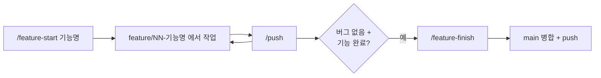

# Git 워크플로우

기능 단위 브랜치로 작업하고, 완료·검증된 기능만 main에 병합한다.

## 흐름

## 커맨드 (Claude Code)
| 커맨드 | 동작 |
|---|---|
| `/feature-start <기능명>` | main 최신화(pull) → `feature/NN-기능명` 생성·전환 (NN 자동 증가) |
| `/push` | 변경사항을 의미 단위로 나눠 커밋 → 현재 feature 브랜치 push |
| `/feature-finish` | 사용자 확인 → main pull → `merge --no-ff` → main push → 브랜치 삭제 여부 확인 |

정의 파일: [.claude/skills/](../.claude/skills/) (`CLAUDE.md`와 함께 `.gitignore`로 제외된 로컬 전용 파일)

## 규칙
### 브랜치
- 형식: `feature/NN-기능명` (영문 소문자 kebab-case, 예: `feature/02-lock-on`)
- main에 직접 커밋 금지

### 커밋 메시지
`타입: 한국어 설명`

| 타입 | 용도 |
|---|---|
| feat | 기능 추가 |
| fix | 버그 수정 |
| refactor | 동작 변화 없는 구조 개선 |
| docs | 문서 |
| chore | 에셋 추가, 프로젝트 설정 등 |

- AI 작성 표기(`Co-Authored-By` 등)는 넣지 않는다.
- 에셋과 `.meta` 파일은 같은 커밋에 포함한다.

### 안전장치
- force push, 훅 우회 금지
- 100MB 이상 파일은 push 전 중단 (GitHub 제한 → Git LFS 검토)
- 병합 충돌 시 자동 해결하지 않고 중단 후 보고
- 병합·브랜치 삭제는 사용자 확인 후에만 실행

## Fork(GUI)와 함께 쓰기
커맨드로 커밋/푸시하고, Fork는 히스토리·diff 확인용으로 사용한다. Fork에서 직접 커밋할 때도 위 메시지 규칙을 따른다.
